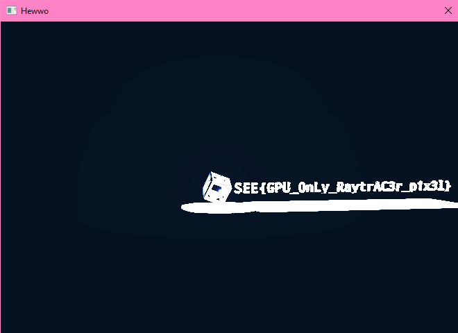

# It's Right There - Solution

**Author**: JuliaPoo

**Category**: RE

Like a regular demoscene binary, the binary is packed with Crinkler.
Unpack the binary in memory by stepping through execution.

Reversing the d3d9 and d3dx apis used, would show that there's two shaders:

- Pass through vertex shader (not interesting)
- Huge pixel shader

Furthermore, there's an [embeded jpg](rsrc/font.jpg) that's used as a texture in the
pixel shader.

The player can then dump the [pixel shader](TODO) and [vertex shader](TODO) 
out (terminated by `0000ffff`). Inspecting the strings reveals that the 
language model is `ps_3_0`.

> Author's note:
> 
> `ps_3_0` is chosen because:
> 1. ~~Has a decent [disassembler](https://github.com/etnlGD/HLSLDecompiler)~~
>      - Buggy af
> 2. Allows bytecode patching (later shader models have annoying checksums)
> 3. ~~Microsoft an assembler for it within `d3dx.dll`. (Later shader models up until 6.0 don't have an assembler).~~
>       - Doesn't matter since disassembler's buggy af
> 
> It's between `ps_3_0` and `ps_6_0` and I'm more familiar with `ps_3_0`.

The player can now attempt to disasemble the pixel shader.
However, attempting to re-assemble the shader with Microsoft's `D3DXAssembleShaderFromFile`
yields a ton of errors, unless the player has somehow found better disassemblers.
All the ones I tried are buggy.

However, the parsing of the constants used is trivial. These constants control various
attributes of the scene, such as the render distance and colour. The player can then
bytepatch these constants.

The player can [write a tiny binary](src/main.cpp) to dynamically load the shaders
and load the font texture with `D3DXCreateTextureFromFile` from files (in [rsrc folder](rsrc)).

With this setup, the player can then modify the bytecode of the pixel shader and run the binary `try.exe` to see the changes.

I wrote a script [ps_config.py](./ps_config.py) to allow easy modifications of the constants. Playing around with the constants yields the following interesting ones:

```asm
def c15, 
    0.5, 
    5, ; <-- Render distance
    2, 
    0.159154937

def c21, 
    -0.5, ; <-- Controls camera
    -1.04716671,
    1.04716671,
    -3 ; <-- Controls camera

def c30, 
    0.500999987, 
    -0.799000025, 
    1.10000002, ; <-- Floor height
    0.499000013

def c34, 
    0, 
    -0.00100000005, 
    -2, 
    3   ; <-- Controls visibility
```

There is also the following constant `c17.x` that at first glance controls
the x-position of the flag. Changing it will shift the flag into view. However,
the compiler has reused `c17.x` to also control the distance between
the characters, causing the flag to get fucked up when it's value changes too much.

By modifying the following constants:

- `c15.y: 5 -> 50`: Render distance increase to 50
- `c21.w: -3 -> -20`: Move the camera wayyy back
- `c30.z: 1.10000002 -> 100`: Move the floor so far down it disappears from view
- `c34.w: 3 -> 0`: Maximum visibility (everything becomes white)

the player moves the camera in such a way that the full flag is visible:

