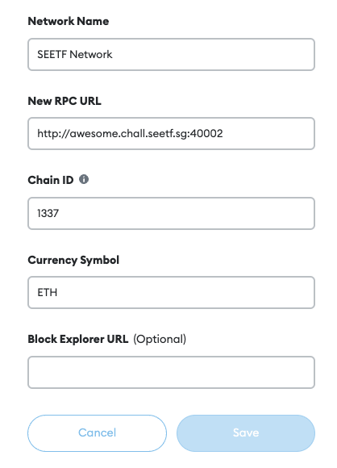
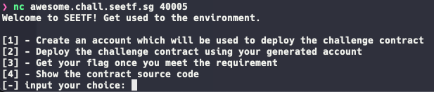
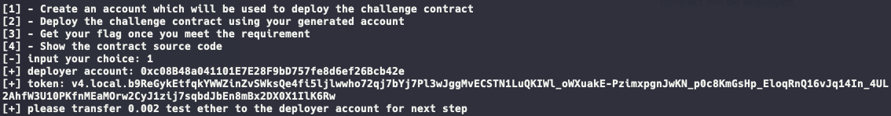
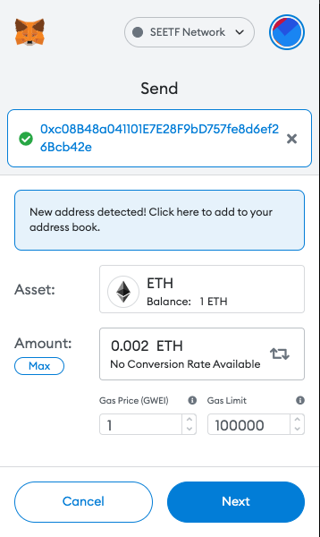
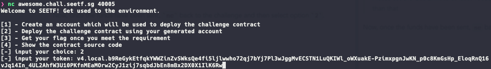
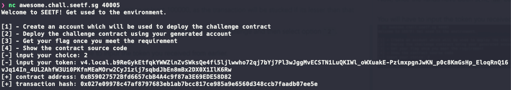

Before you begin, you will need a Metamask account or any account that can interact and send funds.

## Setting Up Metamask

Follow the steps here to setup your [metamask](https://nftnow.com/guides/how-to-set-up-metamask-wallet/).

Then, create a new network and add this network to your metamask. (Follow it [here](https://metaschool.so/articles/how-to-change-add-new-network-metamask-wallet/) if you do not know how)

Your network should look like this once you have set it up.

## Getting Funds to Interact

Proceed to http://awesome.chall.seetf.sg:40001/ to get your funds.

Input your account address to receive 1 test ether to interact and deploy contracts.

> You may request for more than 1 ether, but please do not spam.

Give it a few minutes and you will see 1 ether in your wallet.

## Connecting to the Challenge Environment

You will have to input `1` first to create a new account so that a challenge contract will be deployed.

You will then need to send the respective funds to the deployer account, which in this case is `0.002` ether.

> Take note of your token as that will be used to deploy the challenge and get the flag.

> Please set the Gas Limit to at least 100000, as the transaction will be stucked if its lesser than that

Now, once the funds have been sent, `nc` back to the challenge and then select option `2`.

You will have to input the token you received from earlier.

Once deployed, you will receive the contract address and the transaction hash.

Now, you are ready to play!
